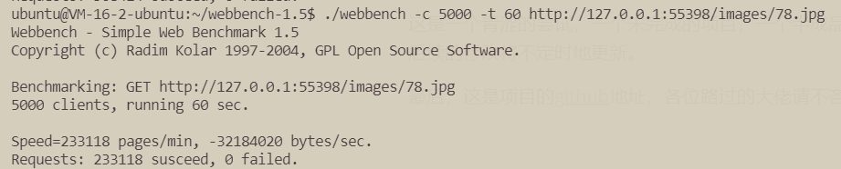
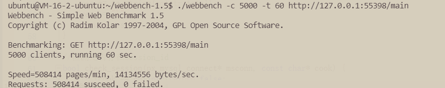
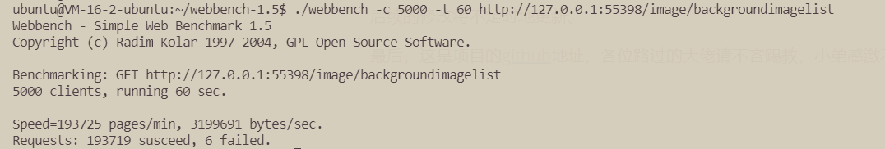

# A simple, module based web server:PHOENIX

This is an unfinished project. Its implementation is very rough, and subsequent modifications will be updated from time to time.

[here](http://www.astar-phoenix.com/) is my homepage,there are more detail.(The language of this website is Chinese)

document version: 0.1 2022-6-20

***

[TOC]


***

## Introduction

Phoenix is a developing, module based and event driven high-performance lightweight web server. Its kernel is a highly modular event processing framework based on reactor mode. The IO reuse of reactor ensures its efficiency, while modularity ensures its flexibility. Of course, Phoenix includes http modules, which support get and post methods, url parameter transfer, and storage of x-form data in request entities. In addition, phoenix also includes a simple MySQL module,which can complete some basic businesses.

There is a [demo](http://43.138.29.143:55398/ ), which is a private gallery built on Vue. All back-end functions are provided by Phoenix

And [here](http://www.astar-phoenix.com/) is my homepage,there are more detail.(The language of this website is Chinese)

## Compile from source

Switch to the **build/** and execute

```bash
cmake .
make
```

The compiled program can then be found in the **bin/**

## Instructions

### Create basic services

```C++
//define a function
void print_hello(px_mysql_connect* msconn, px_http_request* req, px_http_response_data* res) {
    (*res)("success! ", px_http_response_type::TEXT);
}

int main(int argc, char** argv) {
    px_http_server serv;
    serv.initsocket();
    px_http_module* interface_module = serv.interface_module;
    //Define your own code here
    px_http_module* test_module = serv.create_module("test");
    test_module->add_interface("print", print_hello, "get");

    serv.run_service();
}
```

**Running results**

After the program is started, enter ip: port number (55398 by default) /test/print in the browser to get the following results:


### Use HTTP module

**px_http_server** encapsulates the original module and provides a simple way to create a module

```C++
/*As above, you need to define a method first
* msconn is database connection
* req is parsed request
* res is the content returned to browser
*/
void print_hello(px_mysql_connect* msconn, px_http_request* req, px_http_response_data* res) {
    (*res)("success! ", px_http_response_type::TEXT);
}
//...
int main(int argc, char** argv) {
    //...
    px_http_module* interface_module = serv.interface_module;
	//create a module
    px_http_module* test_module = serv.create_module("test");
    //add the function to module
    test_module->add_interface("print", print_hello, "get");
    //add the modutle to top module
    serv.interface_module->add_module(test_module);
	//...
    //We can directly add print to the top-level interface module
    interface_module->add_interface("print2", print_hello, "get");
}
```

### Use raw module

It can be developed directly based on the raw module. The following code has the same effect as the code for creating the interface "print2" above, but it is more complex.

```C++
/*As above, you need to define a method first
* msconn is database connection
* req is parsed request
* res is the content returned to browser
*/
void print_hello(px_mysql_connect* msconn, px_http_request* req, px_http_response_data* res) {
    (*res)("success! ", px_http_response_type::TEXT);
}
//...
int main(int argc, char** argv) {
    //...
    px_http_module* interface_module = serv.interface_module;
	//create a module
    m_response_config* config = new m_response_config;
    config->func = print_hello;
    config->method = "get";
    px_module* http_test_process = new px_module;
    http_test_process->set_name("test_process");
    http_test_process->top_level = false;
    http_test_process->m_type = pxmodule_type::PROCESS;
    http_test_process->callback_func = http_response_json_func;//http_response_json_funcis a well-defined method,it does a lot of work......Its name is a bit strange. In fact, it returns more than JSON format data
    //we set callback_func to http_response_json_func,which help us do some operations related to HTTP messages, and http_response_json_func whill call print_hello by config
    http_test_process->priority = 0;
    http_test_process->config = (void*)config;
    interface_module->mod->add_dispath("print2", http_test_process);
	//...
}
```

**Running results**


### Database query

```c++
//First, we need to create an entity to hold each record
struct entity_image {
    string id;
    string name;
    string path;
    string create_time;
    string update_time;
    //Each entity must contain a parse function, which must be defined as void parse(const MYSQL_ROW& row){...}
    void parse(const MYSQL_ROW& row) {
        id = row[0];
        name = row[1];
        path = row[2];
        create_time = row[3];
        update_time = row[4];
    }
};

void somefunction(px_mysql_connect* msconn, px_http_request* req, px_http_response_data* res) {
//...
    char buffer[128];//storage sql
    strcpy(buffer, "SELECT * FROM px_images WHERE name not like 'xxx';");//sql
    sqlres<entity_image_tojson> queryres;//storage query result
    msconn->execute_sql(buffer, queryres);//begin query,execute_sql has an overloaded function,which contains only one parameter(buffer),the function is used to handle SQL operations that do not return a value, such as insert,update,delete etc.
    (*res)(restojson(queryres), px_http_response_type::JSON);
    for(auto &t:queryres.list){
        //...
        cout<<t.name<<" "<<t.path<<endl;
        //...
    }
//...
}
```

## Pressure test

we use webbench-1.5 for pressure test. The test codes and results are as follows:

1. Get a picture

```bash
webbench -c 5000 -t 60 http://127.0.0.1:55398/images/78.jpg
```

**Running results**



(there is a negative value at bytes/sec, which is obviously an overflow)

2. Get a web page

```bash
webbench -c 5000 -t 60 http://127.0.0.1:55398:55398/main
```

**Running results**



3. database query

```
webbench -c 5000 -t 60 http://127.0.0.1:55398/image/backgroundimagelist
```

**Running results**


